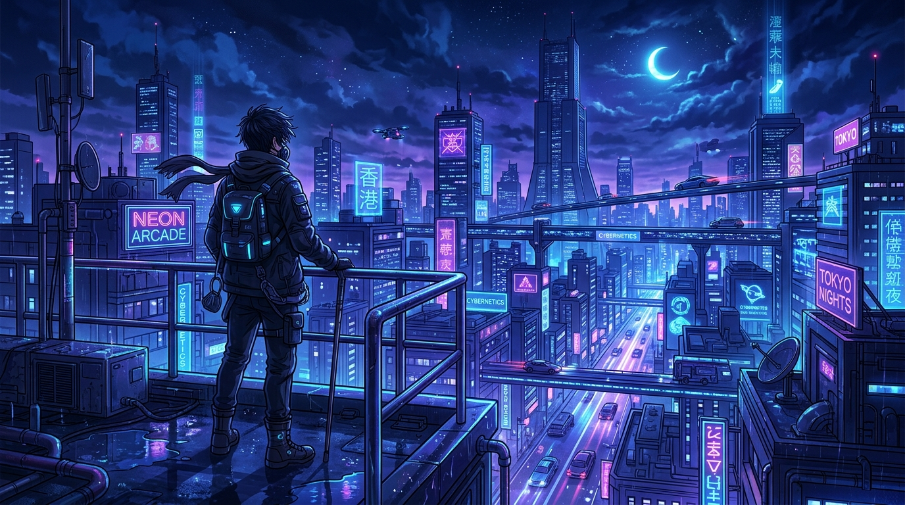
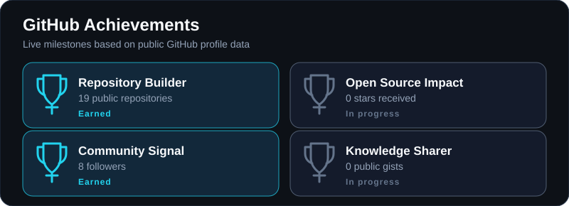
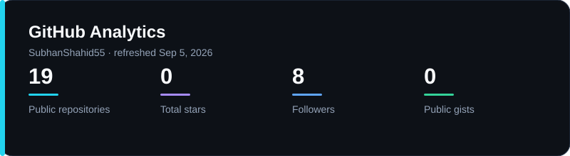
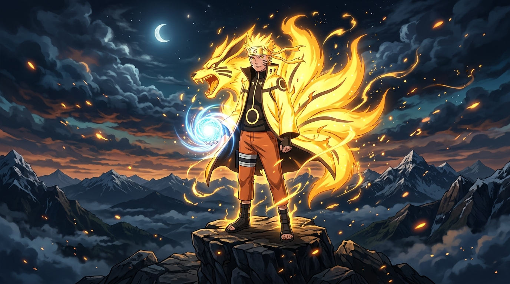
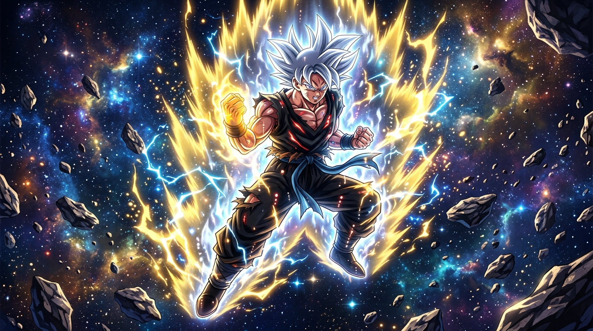

  

  
  
  

 

  

 

<!-- Animated Line Divider -->

 

  

 

<table>
  <tr>
    <td width="60%" valign="top">
      <h2>👋 About Me</h2>
      
I am <strong>Muhammad Subhan Shahid</strong>, a Software Engineer and Full-Stack Developer based in Rawalpindi, Pakistan. I build responsive web applications from interface to API, database, and deployment.

      
My work spans fintech, healthcare, e-commerce, SaaS, and browser extensions. I am open to full-time and freelance Software Engineer, MERN, and Next.js roles.

      <h3>🔥 Current signal</h3>
      <ul>
        <li>🚀 15+ international client projects delivered</li>
        <li>📈 500+ qualified B2B leads generated monthly</li>
        <li>💡 10,000+ daily AI diagnostic requests supported</li>
        <li>⚡ 99.8% backend uptime on production services</li>
      </ul>
    </td>
    <td width="40%" align="center" valign="middle">
      
    </td>
  </tr>
</table>

 

<!-- Animated Line Divider -->

 

## 🛠️ Core Stack

  

 

## 🏆 GitHub Trophies

  

 

<!-- Animated Line Divider -->

 

## 💻 Selected Work

<table>
  <tr>
    <td width="50%" valign="top">
      <h3>📁 Digital Media Archive</h3>
      
A secure, modern workspace for uploading, viewing, downloading, and organizing digital media.

      
<code>React</code> <code>Frontend</code> <code>University Project</code>

      <a href="https://digitalmediaarchive.vercel.app/">View live project</a>
    </td>
    <td width="50%" valign="top">
      <h3>🏠 Homixa</h3>
      
A polished web presence for home services, designed around clear service discovery and conversion paths.

      
<code>Web Development</code> <code>Freelance</code>

      <a href="https://www.homixaleads.online/">View live project</a>
    </td>
  </tr>
  <tr>
    <td width="50%" valign="top">
      <h3>🪙 Meme Coins Agent</h3>
      
A cryptocurrency information platform for live market data, analysis, and meme coin research.

      
<code>Web Development</code> <code>Freelance</code>

      <a href="https://memecoinsagent.info/">View live project</a>
    </td>
    <td width="50%" valign="top">
      <h3>🎯 Habit Tracker</h3>
      
A React app for building routines through progress tracking, streaks, and visual analytics.

      
<code>React</code> <code>Frontend</code>

      <a href="https://github.com/SubhanShahid55">Explore my GitHub</a>
    </td>
  </tr>
</table>

 

## 💼 Experience Highlights

<table>
  <tr>
    <td><strong>Brawse</strong> Junior Software Engineer 2025 to 2026</td>
    <td>Built browser extension UI, popup flows, options pages, and service integrations.</td>
  </tr>
  <tr>
    <td><strong>Smile Check AI</strong> Backend Developer 2024 to 2026</td>
    <td>Improved API latency by 30% through database optimization and caching.</td>
  </tr>
  <tr>
    <td><strong>Devmerce</strong> Freelance Full-Stack Developer 2025</td>
    <td>Delivered solutions for 15+ clients and reduced deployment time by 40% with CI/CD.</td>
  </tr>
  <tr>
    <td><strong>EasyPaisa</strong> Summer Intern 2024</td>
    <td>Supported merchant and retail application features within the Channel and Development Solutions team.</td>
  </tr>
</table>

 

<!-- Animated Line Divider -->

 

## 📈 GitHub Analytics

  

 

## 🐍 Contribution Snake

  <picture>
    <source media="(prefers-color-scheme: dark)" srcset="./assets/generated/github-contribution-grid-snake-dark.svg">
    <source media="(prefers-color-scheme: light)" srcset="./assets/generated/github-contribution-grid-snake.svg">
    
  </picture>

 

## ⚡ Recent Activity

<!--START_SECTION:activity-->
<!--END_SECTION:activity-->

 

<!-- Animated Line Divider -->

 

  

 

<table border="0" width="100%">
  <tr>
    <td width="50%" align="center">
      
    </td>
    <td width="50%" align="center">
      
    </td>
  </tr>
</table>

 

## 🤝 Let us build something useful

  
  
  
  

 

  

